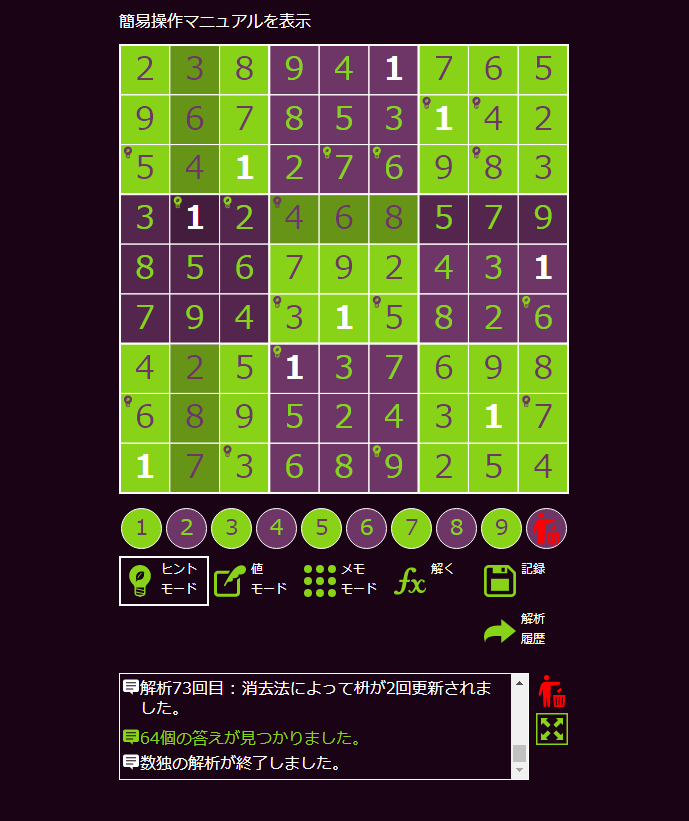
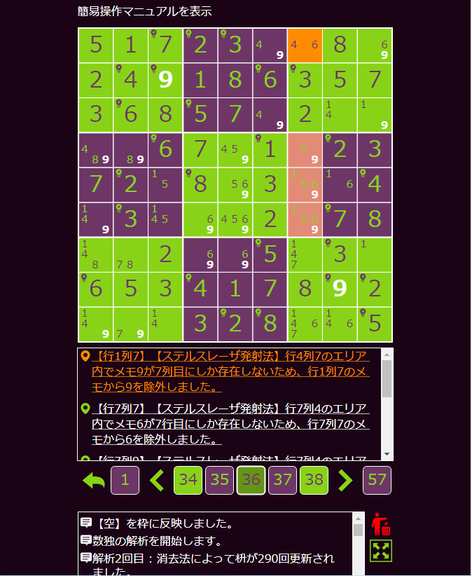
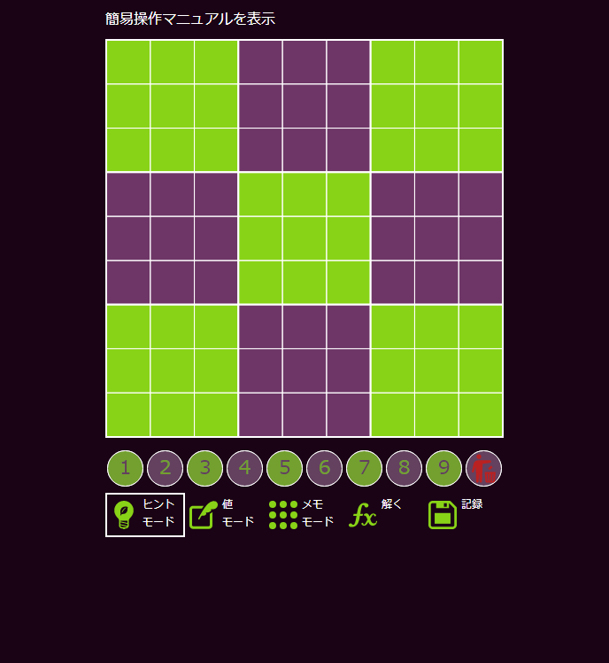
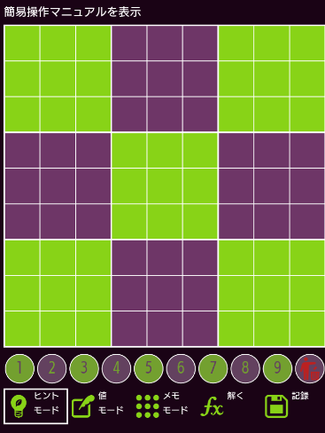

# 数独解析プロジェクト

## 概要

### 数独を解析する



### どのような解析を行って解を導き出したのかを表示する



- 人間が解ける解析方法で解析を行う
- マシーンパワーを使うような解析はデフォルトで行わない

## 主要ライブラリ

- TypeScript v3.4
  - Vue.js v2.6
  - jQuery v3.4
- Python v3.7
  - Django v2.2

詳細は package.json、requirements.txt を参照

## 環境構築手順

### 前提

- npm (Node.js) がインストールされていること
- Python3.7 がインストールされていること

### クライアント(Vue.js)

git clone したフォルダに移動し、以下のコマンドを打つ

```bash
>cd client
# Vue.jsなどのクライアントで使用しているライブラリのインストール
>npm install
# クライントリソースのビルド
>npm run build
```

### サーバ(Django)

git clone したフォルダに移動し、以下のコマンドを打つ

```bash
>cd server
# 仮想環境の作成
>py -m venv sudokuenv
# 仮想環境に入る
>./sudokuenv/Scripts/activate
# Djangoなどのサーバで使用しているライブラリのインストール
>pip install -r requirements.txt
# サーバ起動
>py manage.py runserver
```

PC 版**chrome**または Android 版 **chrome** で以下のページを表示する。

(**chrome** 以外のブラウザは現在未サポート)

<http://localhost:8000/sudoku/>



## スマートフォンで表示

git clone したフォルダに移動し、以下のコマンドを打つ

```bash
>cd client
# Vue.jsなどのクライアントで使用しているライブラリのインストール
>npm install
# webpack-devサーバの起動
>npm run serve

 DONE  Compiled successfully in 16483ms


No type errors found
Version: typescript 3.4.5
Time: 11271ms

  App running at:
  - Local:   http://localhost:8080/sudoku/
  - Network: http://XXX.XXX.XXX.XXX:8080/sudoku/
```

上記の
Network: http://XXX.XXX.XXX.XXX:8080/sudoku/
にアクセスすることでスマートフォンでも画面が見える。



※
同一ネットワークに接続出来る Wifi を使う必要がある。
無線 LAN の設定によっては参照出来ない可能性あり。
